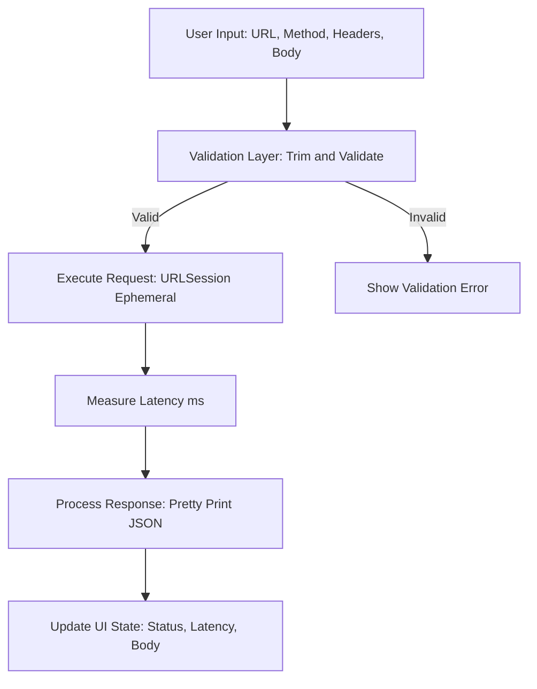
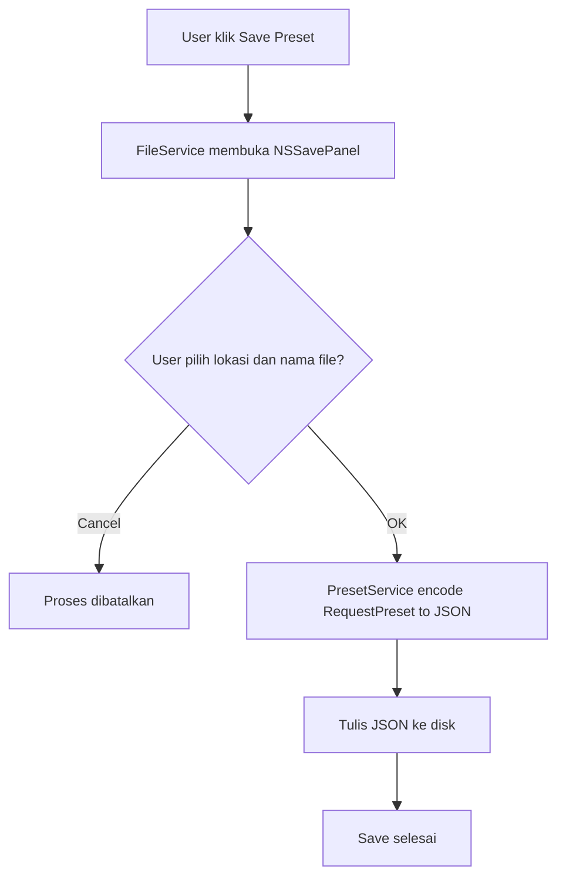
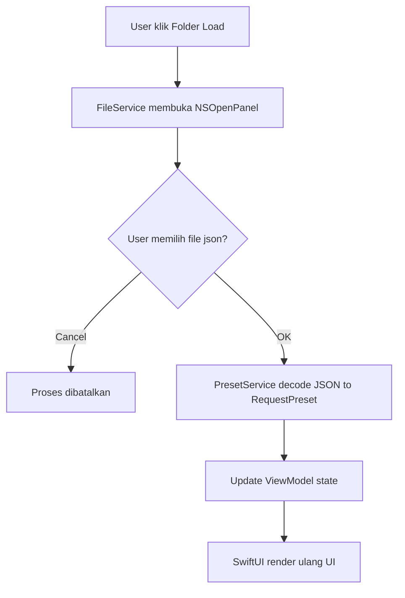
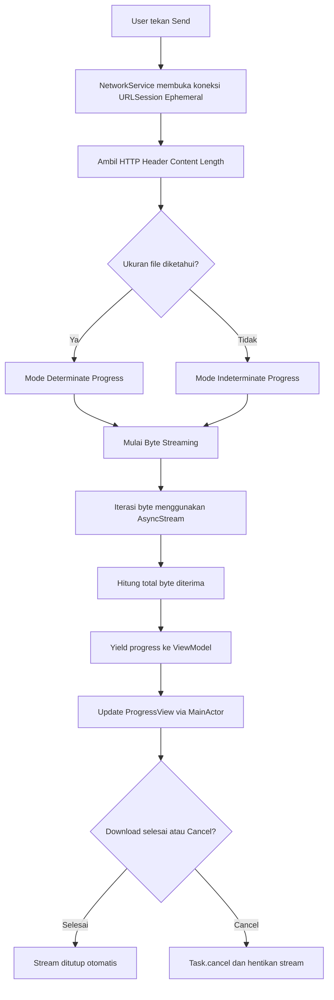

# 🚀 Postie — The Ultra-Lightweight API Client

**Postie** adalah aplikasi native macOS yang dirancang sebagai alternatif ringan untuk API testing (seperti Postman atau Insomnia). Fokus utama aplikasi ini adalah **performa maksimal dengan jejak memori minimal**, tanpa mengorbankan fungsionalitas inti yang dibutuhkan developer.

---

## 🎯 Mengapa Postie?

Sebagian besar API client modern berbasis Electron, yang dapat mengonsumsi ratusan megabyte RAM hanya untuk melakukan satu `GET` request sederhana.

Postie dibangun **100% native menggunakan SwiftUI & AppKit**, dengan tujuan:

- **RAM Usage:** < 50 MB (Postman rata-rata > 500 MB)
- **Instant Start:** Tanpa splash screen, aplikasi siap digunakan seketika
- **Zero Dependencies:** Tidak menggunakan library pihak ketiga (No CocoaPods / SPM), murni Apple SDK

Pendekatan ini memastikan aplikasi tetap **ringan, cepat, dan stabil** bahkan saat digunakan berjam-jam.

---

## ✨ Fitur Utama

- **Full HTTP Methods Support**  
  Mendukung `GET`, `POST`, `PUT`, `DELETE`, dan `PATCH`.

- **Bearer Token Shortcut**  
  Slot khusus untuk autentikasi cepat tanpa konfigurasi header manual.

- **Dynamic JSON Beautifier**  
  Respon JSON otomatis di-*pretty print* agar mudah dibaca dan dianalisis.

- **Latency Evaluator**  
  Indikator visual berbasis durasi request (Excellent, Good, Average, Slow).

- **Preset System**  
  Simpan dan buka konfigurasi request dalam format `.json` yang portabel.

- **Smart Error Mapping**  
  Error teknis dipetakan menjadi pesan manusiawi (Timeout, No Internet, Invalid URL).

---

## 🏗️ Arsitektur & Teknologi  

Postie dibangun dengan pola **MVVM + Service Layer** yang terpisah jelas, memastikan kode mudah dirawat, diuji, dan dikembangkan.

---

### 1. Advanced Networking (`URLSession`)

Menggunakan `URLSessionConfiguration` kustom untuk kontrol penuh terhadap performa:

- **Custom Timeout**  
  Dibatasi 30 detik untuk mencegah UI *freezing*.

- **Cache Policy Disabled**  
  Memastikan setiap request selalu mengambil data terbaru (*fresh data*).

- **Connectivity Handling**  
  `waitsForConnectivity` diaktifkan untuk stabilitas pada jaringan yang tidak konsisten.

---

### 2. Concurrency Management

- Implementasi penuh **Swift Concurrency (async/await)**.
- Semua update UI diamankan dengan `@MainActor`.
- Eksekusi berbasis `Task`, memungkinkan pembatalan request secara efisien.

---

## 🏗️ Alur Kerja & Logika Bisnis (Business Logic Flow)

Postie menerapkan **Stateless Service Architecture**, memastikan setiap request diproses secara independen tanpa meninggalkan *residual state* di memori.

| Tahap | Aktivitas Utama | Teknologi |
|-----|----------------|-----------|
| **Input** | User memasukkan URL, Method, Header, dan Body | SwiftUI View State |
| **Validation** | Trimming URL & validasi format | NetworkService |
| **Execution** | Trigger request asinkron dengan kebijakan zero-cache | `URLSession` (Ephemeral) |
| **Processing** | Hitung latensi (ms) & JSON pretty-print | `JSONSerialization` |
| **Output** | Update Status Code, Latency, dan Response UI | `@MainActor` |

Pendekatan ini menjaga performa tetap stabil bahkan saat melakukan request berulang dalam sesi panjang.

---

## 💾 Manajemen Preset (Save & Open Flow)

Sistem persistensi Postie menggunakan **User-Initiated File Access** untuk menjaga keamanan (Sandboxing) dan efisiensi memori.

### 1️⃣ Alur Simpan (Save Request)

### 2️⃣ Alur Buka (Open Request)

Model ini memastikan:
- Tidak ada background file scanning
- Tidak ada cache tersembunyi
- Kontrol penuh berada di tangan user

---

## 📥 Smart Streaming Download Engine

Fitur ini dirancang untuk melakukan **pengujian throughput jaringan** dan **unduhan file besar**
tanpa mengorbankan stabilitas memori aplikasi.

Pendekatan ini memastikan Postie tetap **responsif, efisien, dan aman** meskipun memproses data berukuran besar.

---

## 🛠️ Teknologi & Konsep Utama

Postie **tidak menggunakan pendekatan download-to-memory konvensional**.
Sebaliknya, fitur ini dibangun di atas fondasi berikut:

- **AsyncStream (Swift Concurrency)**  
  Mengelola aliran data asinkron dan memungkinkan pengiriman update status ke UI
  secara berkelanjutan tanpa memblokir thread utama.

- **URLSession.bytes(from:)**  
  Menggunakan API low-level untuk membaca data sebagai **stream byte**
  alih-alih memuat seluruh file ke dalam satu objek `Data`.

- **MainActor Isolation**  
  Menjamin sinkronisasi antara pipa data jaringan dan pembaruan `ProgressView`
  agar tetap **thread-safe**.

---

## 🔄 Alur Logika Bisnis (Business Logic Flow)

Berikut adalah algoritma yang dijalankan saat user menekan tombol **Send**
untuk melakukan unduhan file besar.

## 🧪 Logic-Driven Unit Testing

Postie tidak hanya fokus pada UI, tetapi juga fondasi logic yang kuat dan teruji:

- **PresetServiceTests**  
  Menjamin integritas data saat proses baca/tulis file preset.

- **NetworkServiceTests**  
  Menguji validasi URL, parsing response, dan JSON pretty-print dari berbagai edge case.

- **RequestViewModelTests**  
  Menguji parsing header kompleks dan sinkronisasi state UI menggunakan Combine expectations.

---

## 📊 Performance Benchmark

| Metric | Postman (Electron) | Postie (Native Swift) |
|------|-------------------|----------------------|
| **Idle RAM** | ~450 MB | **~35 MB** |
| **Startup Time** | ~5–10 detik | **< 1 detik** |
| **Dependencies** | Heavy (Node.js) | **None (Pure Native)** |

---

## 📋 Checklist (Technical Enforcement)

- [x] **Memory Management**  
  Optimalisasi menggunakan `NSTextStorage` dan `setAttributedString` untuk menjaga RAM < 40 MB.

- [x] **Clean Architecture**  
  Pemisahan tegas antara UI (SwiftUI), Logic (ViewModel), dan System Interaction (Service Layer).

- [x] **Native Performance First**  
  0% third-party libraries, 100% Apple SDK.

---

## 🚀 Instalasi

1. Clone repository ini.
2. Buka `Postie.xcodeproj` menggunakan Xcode.
3. Pada **Signing & Capabilities**, atur **App Sandbox**:
   - Enable **Read/Write** untuk *User Selected Files*.
4. Build & Run (`Cmd + R`).

---

## 👨‍💻 Author

**Nunu Nugraha**  
*iOS Developer* yang percaya bahwa aplikasi hebat adalah aplikasi yang **cepat, stabil, dan tepat guna** — bukan yang paling banyak dependency.
